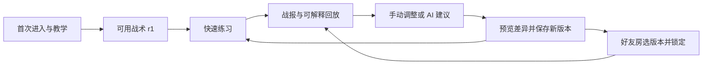

**AgenticGame 全项目审查与改进方案 · 2026-09-05 · 待用户批准实施**

当前版本需要一次覆盖启动、安全、数据、玩法和界面的完整修整。建议保留已有 Electron、TypeScript、确定性引擎和版本化回放基础，按本文五个阶段推进，最终交付一个经过安装与实际操作验收的 B 版候选。

你提供的“安装后打不开”已经定位到构建缺陷。除此之外，本轮还复现了自定义策略被重置、首次练习入口被阻断、外部保存后页面不更新、单条损坏笔记拖垮回放列表、遗留锁阻止保存、移动结果依赖队伍数组顺序，以及缩放后导航消失等问题。它们会直接影响玩家能否完成一轮游戏。

本轮实施的是审查、隔离实验和报告整理。业务源码、现有安装包、便携包均未修改；没有提交、推送或发布。为检查启动之后的界面，另建了只调整打包解析方式的诊断副本，使用独立玩家目录与模拟 AI 客户端目录。诊断副本能打开，不等于现有发行包已修复。

审查基准是 `D:\AgenticGame`，`main` 分支提交 `93c2002482c6c65ee0632193d9bc99fd64334f78`，版本 `0.1.0`。开始时工作区干净。当前机器上没有找到截图所指的已安装目录，因此安装目录本身没有被检查；本轮检查了仓库现有发行产物及重新构建的主进程文件。

下文的“复现”表示执行真实实现或操作诊断副本后观察到结果；“代码确认”表示可以由调用路径或配置直接确定；“设计判断”表示行为已经观察到，但优劣需要按玩家体验目标判断；“待验证”不会被记为测试通过。P0 阻断继续分发；P1 必须在本次质量修整中完成；P2 同样纳入方案，在基础问题收敛后处理。

本轮验证结果如下。

| 检查 | 结果 | 能证明什么 |
|---|---|---|
| `npm test` | 61 个文件、268 项测试通过 | 现有自动化断言通过；不能证明安装包可以打开 |
| `npm run typecheck` | 通过 | 当前类型检查通过 |
| `npm run build` | 通过 | TypeScript 构建通过 |
| `npm run build:desktop` | 通过，但产物仍有启动错误 | 当前打包过程没有检出运行时模块解析失败 |
| `npm audit --json` | 当次结果 0 项已知依赖漏洞 | 不包含项目自身的隔离、权限和业务逻辑缺陷 |
| 发行版 Agent Bridge smoke | 通过：6 个工具、2 个版本、1 场练习 | 独立 Bridge 基本调用链可运行 |
| 两份发行目录中的 `app.asar` | 主进程文件均复现同一模块错误 | 与截图症状一致的发布构建缺陷存在 |
| 原生 Electron 诊断副本 | 完成教学、导航、车库、练习空态、回放及缩放操作 | 绕过已知打包缺陷后的部分真实界面行为 |
| 安装器与桌面 EXE 签名 | `NotSigned` | 当前文件没有 Authenticode 签名；这与本次模块找不到是两件事 |
| 干净 Windows 安装/升级/卸载 | 未执行 | 仍需独立环境验收 |
| 两台设备的 LAN/WAN、重启恢复 | 未执行 | 单机测试不能代替真实双机网络证据 |
| 真实付费模型、长时间运行、规模性能、用户测试 | 未执行 | 服务商兼容性、稳定性及体验目标仍需后续验证 |

测试期间发现现有打包测试会清理整个 `dist/`；随后已用原有构建命令重新生成构建目录。现有发行文件未被重新打包。

覆盖范围包括桌面主进程与 IPC、页面控制器与视图、SavedBuild 与回放仓库、v2 引擎及比赛运行器、Bot 执行环境、教学和练习、好友房协议与传输、Agent Harness/Provider/Bridge、配置接入、旧版导入与诊断、构建和发行脚本。运行验证集中于现有启动故障和影响主要玩家流程的路径；旧版 CLI/网页控制台及归档在线原型主要做边界与构建审阅。

问题及拟定处理如下，每项都附有可验收结果。

**F01｜P0｜发行版主进程无法启动（复现）。**

`agent-connector-service-v1.ts` 顶层引入 `jsonc-parser`。当前 esbuild 构建选择了其 UMD 入口，产物保留 `require2("./impl/format")`，运行时相对主进程 bundle 查找该文件，位置已经错了。两份 ASAR 中都包含 jsonc-parser 相关文件，因此根因不能概括为“没装依赖”。重新构建的 `main.cjs` 与发行目录中的文件完全相同，也会报错。

源码：[接入服务导入位置](D:/AgenticGame/src/desktop/agent-connector-service-v1.ts:5)、[桌面构建入口](D:/AgenticGame/scripts/build-desktop.mjs:15)。证据：[产物装载与哈希结果](D:/AgenticGame/docs/audits/2026-09-05/evidence/artifact-results.jsonl)。

拟定修复：优先对 jsonc-parser 定向选择可正确打包的 ESM 入口；如果包的兼容性验证不通过，则将整个依赖外置并保留完整目录。诊断副本使用 ESM 优先解析后已能进入界面，证明此路线可行，但正式方案需收窄影响范围，并检查全部主进程依赖。建立 bundle 依赖清单与最终产物装载检查，避免仅在 `main.cjs` 旁临时补文件。可选的 AI 接入服务延迟加载，失败时给出可恢复入口。

验收：从最终安装后的开始菜单/桌面快捷方式、便携包解压目录分别启动；使用普通账户、中文及空格路径、没有 Node 开发环境的机器，均能进入首屏并完成一场练习。保留最终文件哈希与启动日志。打包入口选择依据：[esbuild 官方 main fields 说明](https://esbuild.github.io/api/#main-fields)。

**F02｜P0｜Bot 执行环境能越过当前 VM 隔离（复现）。**

上下文直接暴露宿主的 `Object` 等对象，CommonJS 包装还传入宿主对象。通过这些对象的构造器，审查用脚本获得了 VM 外的 `process.version`，真实 Worker 返回 `v22.16.0`。本轮只读取版本字符串，没有读取文件、密钥或环境变量，也没有发送网络请求。这已经足以证明“上下文没有直接提供 process”不能作为隔离保证。

源码：[上下文创建](D:/AgenticGame/src/runtime/bot-worker.mjs:75)、[宿主对象传入](D:/AgenticGame/src/runtime/bot-worker.mjs:108)、[Worker 创建](D:/AgenticGame/src/runtime/sandbox.ts:71)。证据：[无副作用探针结果](D:/AgenticGame/docs/audits/2026-09-05/evidence/sandbox-results.jsonl)。Node 官方明确说明 VM 不是运行不可信代码的安全机制：[Node.js VM 文档](https://nodejs.org/api/vm.html)。

拟定修复：为自定义 Bot 设计明确的执行边界，优先试验无宿主对象桥接的嵌入式解释器，以受限 JSON 数据交换视图和动作；禁用文件、网络、模块加载及非确定性时间。将解释器放进独立进程，配置内存、执行时限、输入/输出字节上限和进程回收；Windows 侧同时评估限制令牌/文件与网络权限。单独换成子进程或换一个 VM 库，都不能直接算作安全修复。

先用现有 Bot 语料验证 QuickJS/WASM 路线的语法兼容、确定性、耗时和资源中断能力，再决定具体封装。技术依据：[QuickJS 官方资料](https://bellard.org/quickjs/)、[QuickJS-WASM runtime API](https://github.com/justjake/quickjs-emscripten/blob/main/doc/quickjs-emscripten/classes/QuickJSRuntime.md)。Windows Job Object 可用于资源及子进程管理，但还需要单独设计访问控制：[Microsoft Job Objects](https://learn.microsoft.com/en-us/windows/win32/procthread/job-objects)。

验收：保留当前逃逸回归用例；在隔离夹具中验证宿主对象、文件、网络、进程与真实时间不可达，死循环、内存膨胀、超长日志、异步任务残留均受限；异常只能结束该 Bot/比赛，主界面和存档仍可用。文档的安全表述必须与实际能力一致。

**F03｜P1｜车库保存会把自定义策略重置为预设（复现）。**

用带自定义源码标记的 r2 模拟 AI 保存结果后，在车库只修改名称并保存，r3 的源码重新变成内置预设；原 r2 仍在，但玩家当前版本已失去自定义源码。根因是保存函数无条件调用 `tacticSource(normalized.tacticId)`。

源码：[GarageService.saveRevision](D:/AgenticGame/src/desktop/garage-service-v1.ts:143)。证据：[行为结果中的 garage-renaming-custom-source](D:/AgenticGame/docs/audits/2026-09-05/evidence/behavior-results.json)。

拟定修复：保存请求携带明确的基础版本；改名称或装备时保留该版本策略。只有玩家主动选择“替换为预设战术”时才替换源码，并预览变化。新版本记录策略来源、父版本、装备差异，继续保持旧版本不可变。

验收：AI/Bridge 保存自定义源码 → 车库改名/改装备 → 新版本保持原源码；明确切换预设时才改变策略。界面显示对应变化，旧版本可回退。

**F04｜P1｜Agent 保存新版本后，已打开的桌面状态过期（复现）。**

桌面打开时，从独立进程向隔离玩家目录保存 r2，随后切回车库/练习仍显示旧状态，练习继续提示需要第二个版本。`ensurePageData` 仅在没有车库缓存时加载，缺少跨进程保存后的失效机制。

源码：[页面数据加载](D:/AgenticGame/src/desktop/renderer.ts:911)。证据：[外部保存后仍被阻断的画面](D:/AgenticGame/docs/audits/2026-09-05/screenshots/06-stale-after-external-save.png)。

拟定修复：仓库写入更新数据代次/版本索引；应用内写入发出状态变更，跨进程写入通过文件通知配合页面进入和窗口恢复焦点时重新校验。草稿保存带基础版本；遇到别人刚保存的版本时保留草稿并展示冲突选择，不能自动覆盖。

验收：Bridge 或 AI 保存后无需重启应用即可选择新版本；草稿不丢失，连续并发保存不出现旧状态覆盖新状态。

**F05｜P1｜新玩家只有一个版本时，连镜像练习也无法开始（复现）。**

控制器和视图都要求至少两个版本，连镜像入口也被隐藏。底层比赛服务实际能够用 r1 对 r1 完成比赛。这是界面与服务规则不一致造成的断路。初始战术又依赖进入车库/练习时惰性建立，直接进入 AI 页的初始化顺序也需要统一。

源码：[控制器限制](D:/AgenticGame/src/desktop/renderer/practice-lab-controller-v1.ts:41)、[视图限制](D:/AgenticGame/src/desktop/renderer/practice-lab-view-v1.ts:6)。证据：[首次练习页面](D:/AgenticGame/docs/audits/2026-09-05/screenshots/03-practice-blocked.png)、[UI 与底层镜像结果](D:/AgenticGame/docs/audits/2026-09-05/evidence/behavior-results.json)。

拟定修复：完成新手初始化就建立一个可出战版本；单版本可以打预设训练对手或镜像。只有“与自己的另一个历史版本比较”要求第二个版本，并给出创建路径。

验收：新玩家无需配置模型、修改代码或先创建第二个版本，就能在首轮流程完成一场练习并打开回放。

**F06｜P1｜好友房不能选择玩家保存的自定义战术（代码确认）。**

好友房当前只提供 scout/medium/heavy 三个 preset。主进程 IPC 仅接受 preset ID，运行时重新创建内置 Build，没有连接车库的 SavedBuild 版本。因此“AI 改好战术，再带去和朋友打”尚未形成完整产品流程。

源码：[好友房 IPC](D:/AgenticGame/src/desktop/main.ts:69)、[运行时选择预设](D:/AgenticGame/src/desktop/friend-room-runtime-v1.ts:138)、[界面选项](D:/AgenticGame/src/desktop/renderer/index.html:569)。

拟定修复：车库、练习、AI、好友房共用版本选择模型；锁定时绑定具体 SavedBuild revision/hash，继续复用现有校验与同步协议。好友房清楚显示自己和对方的版本、装备、锁定与准备状态。

验收：真实双机使用两份不同自定义策略完成选版、同步、锁定、开战和回放；锁定后本机另存新版本不能偷偷改变本场策略；断线恢复仍指向原版本。自定义策略执行必须先通过 F02 的安全门槛。

**F07｜P1｜异常退出遗留的保存锁会持续阻止写入（复现）。**

SavedBuild 和回放仓库用空的 `.save.lock` 加排他创建，正常退出在 finally 中清理，但没有进程身份、存活状态或恢复协议。模拟遗留锁后，保存持续返回 busy，锁仍存在。实际崩溃恰好发生在持锁阶段的全过程尚未注入测试。

源码：[SavedBuild 锁](D:/AgenticGame/src/config/saved-build-repository-v2.ts:56)、[Replay 锁](D:/AgenticGame/src/replay/repository-v2.ts:43)。证据：[orphan-save-lock](D:/AgenticGame/docs/audits/2026-09-05/evidence/behavior-results.json)。

拟定修复：使用记录进程身份和随机持有令牌的锁协议，配套有限重试、活跃锁保护、孤儿锁恢复及写入日志。正式提交前写临时文件、校验并原子替换；内容与关联元数据发生中断时可以恢复。桌面增加单实例协调，Bridge 的独立进程写入仍由仓库协调。

验收：在写入各阶段终止测试进程，重启后恢复保存；不能误删仍被活跃进程持有的锁，不覆盖已有修订，不产生错误的“成功”反馈。

**F08｜P1｜一条损坏笔记会导致整个回放列表加载失败（复现）。**

两场健康回放中，只把一条笔记 JSON 写坏，`library.list()` 就整体拒绝；其他回放仍在磁盘上。问题出在并行列表构建中，笔记加载异常没有按条目降级。回收站的元数据读取也应一起检查。

源码：[本地候选列表](D:/AgenticGame/src/desktop/replay-library-service-v1.ts:225)、[好友候选列表](D:/AgenticGame/src/desktop/replay-library-service-v1.ts:251)、[回收站元数据](D:/AgenticGame/src/desktop/replay-library-service-v1.ts:183)。证据：[one-corrupt-note](D:/AgenticGame/docs/audits/2026-09-05/evidence/behavior-results.json)。

拟定修复：回放内容、索引和附属笔记分别校验；单条失败展示对应状态，保留可播放主体并隔离损坏笔记。支持恢复备份、重新写笔记及导出诊断。

验收：混合健康/坏回放/坏笔记/缺失文件时，健康卡片保持可用；一个条目出错不会让整个页面或回收站消失。

**F09｜P1｜教学没有产生足够的可观察学习内容（行为复现、设计判断）。**

三种 doctrine 的实际教学都运行 40 tick 后到达时限，双方 HP 从头到尾不变。scout 和 medium 因对手剩余绝对 HP 更高而输，heavy 平局；教学说明只给出胜者或平局。界面展示最终状态，难以理解移动、命中、装甲和目标规则。预设 Bot 每回合返回固定动作，不读取战场视图。

源码：[教学服务](D:/AgenticGame/src/desktop/tutorial-match-service-v1.ts:26)、[预设行为](D:/AgenticGame/src/desktop/preset-builds-v1.ts:33)、[时限结算](D:/AgenticGame/src/core/v2/gameplay-engine.ts:317)。证据：[三个教学实跑结果](D:/AgenticGame/docs/audits/2026-09-05/evidence/mechanics-results.json)、[教学结果画面](D:/AgenticGame/docs/audits/2026-09-05/screenshots/01-tutorial-result.png)。

拟定修复：设计短小且可控的教学场景，依次展示移动/瞄准、一次命中、装甲方向和胜负条件；提供播放、暂停、跳过、重看。用基于视图的三个基础 Bot 展示侦察、均衡、重装的真实差异。教学优先让玩家看懂一个结果，不要求首次接触就配置外部 AI。

绝对 HP 判胜属于现有规则，不能直接叫代码写错；但不同最大 HP 的车型零交战时就分胜负，不适合当前教学和战术对比。建议歼灭模式超时默认平局，据点模式按明确的目标进度结算；如果保留伤害/剩余比例决胜，必须作为独立规则写清并验证车型平衡。新规则使用新版本号，旧回放按旧规则解释。

验收：每条教学路径都出现预期教学事件，说明引用真实事件；玩家可以复述“为什么结束、如何造成伤害、下一步如何调整”。自动化应检查事件与规则，不只检查存在帧数。

**F10｜P1｜移动冲突结果依赖队伍数组排列（复现）。**

在对称空地图中，两辆相同车同时驶入同一空格，先处理的数组元素获得该位置。保持各队的物理出生位置不变、只反转 teams 与对应 spawn 数组后，占位胜者从 a 变成 b。原因是逐辆移动时读取了已经被上一辆修改的状态。

源码：[移动更新循环](D:/AgenticGame/src/core/v2/gameplay-engine.ts:200)。证据：[simultaneous-cell-collision](D:/AgenticGame/docs/audits/2026-09-05/evidence/mechanics-results.json)。

拟定修复：同一 tick 先收集移动意图，再按公开且与数组顺序无关的冲突规则同时提交；检查对向交换、跟车、拐角和多事件结算的一致性。建议双方争同一格时都阻挡，避免给固定座位优先权。

验收：重排团队数组不改变对应物理结果；交换双方和出生点的成对测试满足对称规则。规则修订后，不以新引擎重新解释旧版本比赛。

**F11｜P1｜普通练习回放导出含完整源码，且文件不易找到（复现、代码确认）。**

“保存回放文件”对练习赛直接导出完整 bundle，包含 `botArtifacts`、Bot 源码及原始 actions；好友回放则是 public 结构，两者共用普通导出入口。界面没有区分适合分享的回放和含策略的完整备份。导出写入应用目录，只返回文件名，没有系统另存为或打开文件夹动作。

源码：[导出实现](D:/AgenticGame/src/desktop/replay-library-service-v1.ts:148)、[导出按钮](D:/AgenticGame/src/desktop/renderer/replay-library-view-v1.ts:36)。证据：[default-practice-export](D:/AgenticGame/docs/audits/2026-09-05/evidence/behavior-results.json)。

拟定修复：默认导出公开可播放回放；“完整策略备份”单列，明确包含哪些源码。使用系统保存对话框，完成后可打开文件夹，提供对应导入路径和兼容性提示。诊断文件同样能找到，并在生成前说明实际包含字段。

验收：普通分享文件不含源码、原始私有诊断和密钥；完整备份经明确选择后可导出并还原；用户能在系统文件夹找到刚保存的文件。这里针对意外分享，不能据此承诺好友执行协议会向执行方隐藏策略。

**F12｜P1｜发布测试没有验证最终安装后的完整入口（复现、代码确认）。**

现有 UI 测试中有大量源码字符串断言；它们能发现元素被误删，不能检验窗口装载、真实 DOM 状态和完整玩家流程。当前仓库没有 GitHub Actions 配置。`release-cjs-assets-v1.test.ts` 调用 `pack.mjs`，后者会递归清理整个 `dist/`，不同构建任务共用输出目录，容易相互干扰。

源码：[现有桌面测试](D:/AgenticGame/tests/desktop-shell-v1.test.ts:13)、[打包测试](D:/AgenticGame/tests/release-cjs-assets-v1.test.ts:10)、[全量清理 dist](D:/AgenticGame/scripts/pack.mjs:9)。F01 是当前测试缺口的实际后果。

拟定修复：按 CLI/Bridge/desktop 隔离输出；测试在临时目录构建，增加构建不可污染检查。建立 Windows 流水线，顺序执行类型/单元与集成/桌面流程/打包/最终文件校验；最终安装及解压产物继续执行启动和练习 smoke。每个候选用可区分版本、提交号、哈希、验收记录绑定。

验收：故意引入当前模块解析错误时流水线必须失败；连续两次构建不会混入旧产物；从测试记录能追溯交付的是哪一个文件。签名状态单独展示，不能以签名或编译成功替代启动验证。

**F13｜P1｜界面放大后主导航消失（原生窗口复现）。**

用窗口缩放快捷键连续放大后，侧边栏被隐藏，设置页没有出现抽屉或其他替代导航；恢复默认缩放后导航返回。CSS 在视口宽度不超过 900px 时直接 `display: none`。本轮确认的是应用缩放路径，没有把它等同于全部 Windows 高 DPI 场景均已测试。

源码：[响应式规则](D:/AgenticGame/src/desktop/renderer/styles.css:453)。证据：[导航消失画面](D:/AgenticGame/docs/audits/2026-09-05/screenshots/09-zoom-navigation-lost.png)。

拟定修复：宽屏使用侧栏，中等视口使用紧凑导航，窄视口提供带文字的菜单按钮与抽屉；各页面的主要操作始终可到达。明确支持窗口尺寸和缩放范围，逐一验证滚动容器。

验收：支持范围内 100%/125%/150%/200% 缩放和 Windows 高 DPI 下，所有页面可进入、可返回，主要操作无截断；不能依靠用户知道恢复缩放快捷键自救。

**F14｜P2｜启动或个人资料损坏后的恢复不足（代码确认）。**

主进程没有统一的启动失败界面；窗口加载失败、渲染进程退出缺少专门恢复流程。Renderer bootstrap 失败主要显示短暂 toast。个人资料损坏会先隔离再抛错，下一次缺失读取可能进入新建资料流程，缺少明确的恢复选择。

源码：[窗口及 app 初始化](D:/AgenticGame/src/desktop/main.ts:176)、[Renderer bootstrap](D:/AgenticGame/src/desktop/renderer.ts:883)、[资料加载](D:/AgenticGame/src/desktop/player-profile-repository-v1.ts:20)。

拟定修复：提供小而稳定的启动层、错误码、持久错误页、重试和导出诊断；提供最近正常资料备份及恢复入口。错误日志轮转并脱敏，恢复流程不删除健康战术和回放。

验收：损坏资料、不可写目录、缺资源和 renderer crash 各有独立故障注入；玩家能看到可执行的下一步，旧数据保持可恢复。

**F15｜P2｜只修改版本说明时，保存会静默忽略文字（复现）。**

只有 `saved.created` 为 true 才保存说明，内容相同会去重返回旧版本，因此仅改 note 时说明仍是旧值。界面不应统一宣称新版本已保存。

源码：[说明保存条件](D:/AgenticGame/src/desktop/garage-service-v1.ts:174)。证据：[garage-note-only-save](D:/AgenticGame/docs/audits/2026-09-05/evidence/behavior-results.json)。

拟定修复及验收：区分内容修订和可编辑元数据；只改说明就更新说明，重复保存无变化明确提示；重新进入页面和重启后读回一致，内容 hash 不因笔记改变。

**F16｜P1｜网络响应和传输分片缺少完整的资源边界（局部复现、代码确认）。**

DataChannel 用 message ID 累积未完成分片，缺少跨消息的数量/内存上限与超时；close 本身只发状态，直到 dispose 才清 pending。发送端也没有按 `bufferedAmount` 背压。有限探针仅发送 3 个部分消息，就分配了 196608 个分片槽，close 后仍保留；未进行耗尽内存的攻击。Provider HTTP 则先 `arrayBuffer()` 读取全部数据，再判断体积，无法限制未知 Content-Length 的峰值内存。

源码：[DataChannel pending](D:/AgenticGame/src/friend-room/data-channel-peer-v1.ts:44)、[分片分配](D:/AgenticGame/src/friend-room/data-channel-peer-v1.ts:118)、[HTTP 读取](D:/AgenticGame/src/agent/providers/provider-http-v1.ts:65)。证据：[partial-peer-frames-after-close](D:/AgenticGame/docs/audits/2026-09-05/evidence/mechanics-results.json)。

拟定修复：限制单帧、单消息、并发消息、累计字节与等待时间；close/error 立即释放；发送端分批并等待缓冲水位。Provider 改为流式计数读取，超过上限立刻取消；统一限制 Bot 源码、名称、日志和 IPC 输出的字节数。

验收：乱序、重复、缺片、超大声明、无长度 HTTP 流、断线各有有界夹具；拒绝输入后资源可回收，健康会话可以继续。

**F17｜P2｜取消没有贯穿正在运行的比赛（代码确认）。**

AI matrix 在比赛前后检查 signal，但实际 `runPracticeMatchV2` 没有收到取消信号，工具执行也缺少一致的取消传播。用户取消后可能还要等当前比赛结束，界面又缺少阶段进度。

源码：[矩阵比赛](D:/AgenticGame/src/desktop/agent-center-service-v1.ts:275)、[Harness 工具调度](D:/AgenticGame/src/agent/harness-v1.ts:108)。

拟定修复及验收：统一 job ID、阶段进度、deadline 与 AbortSignal，传递至 provider、工具和运行器；取消时回收本地执行进程。点击后 1 秒内显示已收到取消，本地工作在目标 2 秒内结束或明确显示清理状态；保留已经完成的结果，取消状态不得显示为成功候选。

**F18｜P2｜AI“变强”的评测依据过窄（代码确认、设计判断）。**

matrix 固定使用一张地图、duel 模式、固定双方位置，对手为原版本，只变化少量 seed。输入目标可能涉及据点，却没有对应模式评测；固定 Bot 的行为也不一定因 seed 改变。3/5/10 场不能自动代表覆盖了同等数量的不同有效场景。

源码：[矩阵评测配置](D:/AgenticGame/src/desktop/agent-center-service-v1.ts:275)。

拟定修复及验收：使用交换出生侧的成对比赛，按目标选模式，加入不同预设与场景、保留一组未参与调参的验证场次；同时报告胜平负、违规率、伤害/目标指标和样本范围。结论使用“在这些测试中改善”，避免单场胜利直接宣称整体变强；每个报告能追溯版本和评测条件。

**F19｜P2｜AI 客户端“已连接”状态只验证了静态配置（代码确认）。**

接入服务主要检查目录、Bridge 文件及配置条目匹配，没有验证目标客户端已经读取配置并成功调用 MCP。配置备份是一次性的；写入虽然用了原子替换，但读取到写入之间没有比较文件是否被客户端修改。TOML 手工合并路径还需要覆盖引号键和复杂排版。

源码：[接入状态及配置写入](D:/AgenticGame/src/desktop/agent-connector-service-v1.ts:59)、[静态匹配判 connected](D:/AgenticGame/src/desktop/agent-connector-service-v1.ts:164)。本轮没有改动真实 AI 客户端配置。

拟定修复及验收：区分未安装、可接入、配置已写入/待重启、Bridge 自检通过、客户端实际调用成功；每次改动做有版本的备份、写前比较与写后解析回读；冲突时不覆盖用户内容。用真实配置夹具验证注释、引号键、已有其他 MCP、Unicode 路径、客户端并发保存及便携包搬迁；撤销只恢复本应用负责的条目。

**F20｜P2｜视觉层级、控件与玩家语言不一致（实测、设计判断）。**

暖色深色基调可以保留，但主页主要是五张同权重导航卡，缺少当前战车和明确主动作。大量辅助说明为 8–11px；AI 页部分下拉框保留浏览器默认外观，“重新检查”因通用 `.text-button` 的绝对定位跑到页头远处。车库几乎全是表单，速度直接显示内部数值 800，缺少单位和比较意义。“最近活动”仍是固定提示句。

源码：[字号与通用定位](D:/AgenticGame/src/desktop/renderer/styles.css:62)、[AI 控件](D:/AgenticGame/src/desktop/renderer/index.html:315)、[静态活动](D:/AgenticGame/src/desktop/renderer/index.html:79)。证据：[主页](D:/AgenticGame/docs/audits/2026-09-05/screenshots/02-command-center.png)、[车库](D:/AgenticGame/docs/audits/2026-09-05/screenshots/04-garage.png)、[AI 页](D:/AgenticGame/docs/audits/2026-09-05/screenshots/05-agent-center.png)。

拟定改进：建立小型组件与样式规范，统一按钮、表单、焦点、提示、对话框、空态及加载态；正文默认 14–16px，次要说明原则上至少 12px，行距 1.5 左右。主界面围绕“当前战术、开始练习、最近战报”组织；重要信息用文字、形状和颜色共同表达。玩家数值带单位与比较，如开阔地理论最高格/回合，并解释加速和地形影响。

验收：逐个页面检查普通文字对比度至少 4.5:1、大字至少 3:1，状态与焦点可辨，中文长文本无截断，原生输入行为和统一外观兼容。不能凭深色背景就认定对比度足够：[WCAG 对比度说明](https://www.w3.org/WAI/WCAG22/Understanding/contrast-minimum.html)。

**F21｜P2｜回放播放器位置与操作反馈妨碍复盘（实测、代码确认）。**

从回放库打开一场比赛后，列表仍留在上方，播放器追加在下方，播放控制需要继续滚动寻找。打开流程最后重新 render 列表，影响显示状态。关键时刻主要是文字 article；地图单位设置了 `pointer-events:none`，依赖 title 的细节也不易触达。

源码：[回放库打开流程](D:/AgenticGame/src/desktop/renderer.ts:1155)、[动作后的统一重绘](D:/AgenticGame/src/desktop/renderer.ts:1218)、[地图单位指针行为](D:/AgenticGame/src/desktop/renderer/styles.css:200)。证据：[播放器出现在列表下方](D:/AgenticGame/docs/audits/2026-09-05/screenshots/07-replay-layout.png)。

拟定改进及验收：使用独立播放页面，返回时保留列表筛选与滚动位置。战场、双方状态和时间轴在首个可见区域；支持播放/暂停、逐帧、调速、点击事件跳转、选择单位查看详情。练习、好友房和教学共享同一播放组件；空格与方向键只在播放器获得相应焦点时工作，不干扰文本输入。

**F22｜P2｜对话框的键盘行为没有统一（代码确认）。**

新手和离房流程已做部分焦点处理，但回放删除、清空回收站主要通过 hidden 显隐，缺少统一初始焦点、焦点约束、Esc 取消及关闭后返回触发点。`aria-modal` 本身不会实现这些行为。

源码：[清空确认](D:/AgenticGame/src/desktop/renderer.ts:261)、[删除确认](D:/AgenticGame/src/desktop/renderer.ts:1183)。

拟定改进及验收：统一可访问对话框控制器；危险操作默认焦点放在取消，背景不可交互，Tab 不跳出对话框，Esc 取消，关闭返回原入口。测试只操作隔离回放，不用用户资料做删除演练。

**F23｜P2｜数据量增加后的性能没有测量基线（代码确认、待性能验证）。**

车库和回放列表会扫描、加载并校验回放；列表工作中存在重复读取及不受控并发。回放呈现也会逐帧更新较多 DOM。当前小数据夹具不能证明已经卡顿，也不能说明大数据下没有问题。

源码：[回放候选读取](D:/AgenticGame/src/desktop/replay-library-service-v1.ts:225)、[车库快照](D:/AgenticGame/src/desktop/garage-service-v1.ts:113)、[播放定时更新](D:/AgenticGame/src/desktop/renderer.ts:1242)。

拟定改进及验收：先测 100/1000 场回放、500 个修订的加载时间、主线程长任务、峰值内存和重复进入后的资源释放，再引入分页索引、增量完整性检查、有限并发及必要的渲染优化。建议目标是在约定参考机上首屏列表 P95 小于 1 秒、温启动 P95 小于 3 秒；这是待测目标，首轮基线后记录硬件与实现成本，不把目标写成已有性能。

**F24｜P2｜文档、旧入口和实际产品能力需要统一（代码确认）。**

README 同时包含旧 CLI/网页体验、当前桌面 B 版和不同强度的沙箱描述；“坏文件只影响自己的卡片”又与 F08 实际行为不符。设置页也有“B 版程序生成基线”等开发阶段说明。用户难以判断哪个入口、功能和限制适用于下载的版本。

源码：[README 沙箱描述](D:/AgenticGame/README.md:103)、[回放可靠性描述](D:/AgenticGame/README.md:193)、[另一个安全边界说明](D:/AgenticGame/README.md:229)、[设置界面](D:/AgenticGame/src/desktop/renderer/index.html:383)。

拟定改进及验收：README 首屏只给当前可交付桌面入口、安装方法与首次练习路径；旧 CLI/在线原型移到明确的历史/开发文档入口。按修复后能力更新安全和连接说明。界面用玩家能理解的操作反馈，开发信息集中于诊断；每条“支持/保证”都能对应实际测试记录。

**F25｜P2｜Electron IPC 和导航边界仍需加固（代码确认，未构造远程攻击链）。**

窗口已启用 contextIsolation、关闭 nodeIntegration 并启用 renderer sandbox，这些基础应保留。IPC 主要验证参数，尚未统一验证 sender/frame；新窗口被拦截，但没有一致的顶层导航与权限请求策略。本轮没有证实远程页面可以实际执行某项敏感 IPC。

源码：[窗口安全配置](D:/AgenticGame/src/desktop/window-contract-v1.ts:39)、[IPC 注册](D:/AgenticGame/src/desktop/main.ts:69)、[新窗口处理](D:/AgenticGame/src/desktop/main.ts:182)。

拟定改进及验收：所有 IPC 经统一包装验证发起 webContents、主 frame、可信本地页面及参数；对导航、新窗口和浏览器权限采取明确策略，外链统一走受控系统浏览器入口。用伪造 sender、子 frame、异常参数和导航夹具确认拒绝，同时保持合法页面功能。依据：[Electron 安全建议](https://www.electronjs.org/docs/latest/tutorial/security)。

上述问题应围绕以下玩家流程共同修复，避免每个页面各自保存一份状态：

这条流程中，AI 是玩家的可选增强入口。没有 API Key、没有外部 AI 客户端、没有好友在线时，游戏仍应有可完成的单机体验。

视觉改进按以下页面交付，保留当前暖深色、橙色强调和军事题材，强化战车、战场与结果的视觉表达。

| 页面 | 建议的信息布局与主动作 | 需要一起设计的状态 |
|---|---|---|
| 首次进入 | 简短介绍 → 选战车风格 → 可播放教学 → “开始第一场练习” | 可跳过、可重看、加载失败重试；完成时已有 r1 |
| 指挥中心 | 中央展示当前战车/战术与“快速练习”；次级入口为好友对战；下方真实最近战报 | 首次、已有战报、外部新增版本、进行中的任务 |
| 我的车库 | 左侧战车与装备可视化，右侧当前配置；下方版本时间线；保存前展示改变了什么 | 草稿、外部更新冲突、无变化、保存失败、损坏版本 |
| 战术实验室 | 明确的双方选择和模式说明；单版本可打预设；完成后直接进入战报 | 可开始、运行阶段、取消、失败、重试、结果 |
| 好友房间 | 连接 → 战前准备 → 双方锁定 → 比赛/战报的连续流程；始终可见连接状态 | 等待、版本不兼容、同步中、断线、恢复失败、重新会合 |
| AI 战术教练 | 先写目标与选基础版本，连接/模型配置折叠为辅助；展示真实进度、评测范围和候选差异 | 未配置、待客户端重启、运行、取消、没有改进、可保存 |
| 回放工作室 | 列表和播放器各占一个清晰页面；地图、血量/目标与播放控制在首屏 | 无回放、坏笔记、坏回放、筛选无结果、导入失败 |
| 设置与帮助 | 玩家设置优先；诊断、数据恢复、版本信息分组；导出完成后提供文件入口 | 未保存、保存成功、检查中、部分检查失败、恢复选择 |

组件规范应覆盖正常、悬停、焦点、禁用、加载和错误状态；交互区域建议不小于 40–44px，重点信息避免 8–11px 小字。每个页面只突出当前阶段的一项主动作。战场使用队伍文字/形状与颜色双重标识，明确炮塔朝向、受击反馈、生命值、装填和目标状态。动画仅表现已确定的比赛事件，不参与规则计算；“减少动效”保留信息但减少位移与闪烁。声音需要分别实测音量、静音、命中和胜负提示，本轮没有完成听感验收。

当前界面的两处典型证据如下，正式改造应同时解决可达性与信息层级。

实施顺序按依赖划分为五个阶段。各阶段内部持续检查、修复、再检查，最终统一提交用户验收。

| 阶段 | 具体交付物 | 主要问题 | 完成门槛 | 相对工作量 |
|---|---|---|---|---|
| 1. 恢复启动并建立安全边界 | 稳定启动层、正确打包、最终产物 smoke；隔离运行器技术验证与实现；基础故障记录 | F01、F02、F12 的基础部分、F14、F25 | 最终目录可启动；逃逸与资源限制回归通过；启动失败可诊断 | 大，隔离方案是主要不确定项 |
| 2. 修复版本与数据流程 | 统一 SavedBuild 选版/刷新/草稿语义；初始练习；锁与损坏恢复；安全导出和导入 | F03–F08、F11、F15 | 新玩家及跨进程保存流程闭环；故障注入下健康数据仍可用 | 大 |
| 3. 改进对战、教学与 AI 评测 | 无座位偏向的移动规则、新规则版本、可解释教学、实用预设、取消和评测矩阵、传输限额 | F09、F10、F16–F19 | 对称性、教学事件、取消、评测追溯、网络夹具通过 | 大 |
| 4. 完成视觉与交互改造 | 全页面组件规范、战车/战场表达、独立回放播放器、响应式导航、键盘与动效体验 | F13、F20–F22、F24 的界面部分 | 完整流程实测；缩放、焦点、长文本、异常和空态可用 | 大，可在阶段 2 后开始设计并逐步接入 |
| 5. 发布级验证与文档交付 | Windows 构建流水线、规模性能记录、真实安装/升级/卸载、双机测试、最终哈希和已知限制 | F12 完整闭环、F23、F24 | 下表发布验收项通过，交付文件与记录一一对应 | 中，需安排独立机器与网络 |

相对工作量用于安排顺序，不是工期承诺。阶段 1 的解释器兼容与 Windows 权限边界需要先取得证据，才能可靠细化后续日程。可独立的设计和测试夹具可以在依赖允许时并行推进，不需要你逐阶段验收。

关键技术选择建议如下。

| 选择 | 推荐方向及理由 | 代价与备选 |
|---|---|---|
| 桌面与前端 | 保留 Electron/TypeScript，把 renderer 的页面状态、长任务和组件边界拆清 | 原生 DOM 仍需认真管理状态；只有维护复杂度实际要求时才评估引入框架 |
| 存储 | 保留不可变 SavedBuild/Replay 文件，增加可靠协调写入、索引与恢复 | 多文件一致性需要日志和故障测试；如果规模基线证明不足，再评估 SQLite 作为索引/元数据层 |
| Bot 执行 | 受限解释器 + 数据边界 + 独立进程/OS 约束，先做兼容与性能验证 | 新运行器有迁移成本；回退方案必须通过同一隔离验收，不能只增加 VM 黑名单 |
| 规则演进 | 新规则显式版本化，旧回放继续按原内容和规则播放 | 要维护兼容测试；不在迁移时改写旧文件 hash |
| 联网范围 | 继续 LAN 与 WebRTC 邀请直连，完善状态、恢复和测试 | 严格 NAT 仍可能失败；TURN/自建信令属于单独的部署和成本决策 |
| 发行签名 | 本次明确展示真实签名状态，先保证产物可用和可追溯 | 可信签名证书或签名服务需要另外确认资源与费用，不能靠本地自签名冒充受信任发行 |

发布验收必须检查用户实际拿到的东西，而不只检查开发目录。

| 验收组 | 必须执行的场景与通过标准 |
|---|---|
| 安装与启动 | 干净普通 Windows 账户；无 Node；中文/空格路径；安装、桌面/开始菜单启动、便携启动；均能完成第一场练习 |
| 升级与回退 | 旧版资料升级；卸载按约定保留数据；再安装读回；迁移前备份，旧版兼容失败有明确恢复办法 |
| 玩家完整流程 | 新建资料 → 教学 → 练习 → 回放 → 保存新版本 → 对比练习；可选 AI 生成版本在车库与好友房一致可见 |
| 源码与版本 | 改名/装备不重置策略；笔记可单独更新；重复保存反馈真实；并发写入不丢版本 |
| 故障与恢复 | 写入时终止进程、坏 JSON、坏笔记、坏回放、缺文件、不可写目录、renderer crash；健康数据保持可用 |
| 隔离与资源 | 当前 VM 逃逸回归失效；受限访问、死循环、内存/日志/IPC 超限可终止且不拖垮主进程 |
| 比赛与回放 | 对称性/重排不变性、命中与装甲、胜负结算、同输入确定性；旧规则回放和新规则回放分别通过 |
| AI 与接入 | 配置夹具并发保护；Bridge 握手；至少各选一个支持的真实 Provider 验证；取消、限额、失败重试与候选保存 |
| 真实好友房 | 两台设备 LAN；两种 WAN 条件；选自定义版本、锁定、对战、断线与重启恢复；失败条件有明确提示和退出路径 |
| 分享与隐私 | 普通回放导出字段检查、完整备份明确选择、导入回读；诊断与日志不含密钥及不必要的私密字段 |
| UI 与可访问性 | 约定分辨率/Windows DPI 与 100–200% 应用缩放；键盘全流程、弹窗焦点、文字对比、减少动效、声音设置 |
| 性能与稳定性 | 记录硬件和数据规模；100/1000 场回放、500 修订基线；连续比赛与反复切页的资源回收；不把未测指标写入宣传 |
| 新手可用性 | 建议邀请 5 名未参与开发的人；目标至少 4 人无需指导在 3 分钟内开始首场练习，并能从回放指出一项改进；这是待验证目标 |
| 发布门槛 | P0/P1 清零；本方案约定的 P2 完成并验证；没有未解释的阻断失败；候选版本、提交、哈希、签名状态及已知限制齐全 |

本方案保持 Public Beta B 的范围：可独立游玩的本地体验、版本化战术、AI 辅助和好友对战。账号、排位、匹配平台、支付、商业美术整包、自建中继及商店上架属于后续产品范围；当前质量问题的修复不依赖这些建设。两台设备、干净 Windows 环境以及真实 Provider 凭据若实施时不可用，对应验收必须保留为明确待完成项，不能写成已通过。

建议批准上述五阶段完整修整，并以“从下载到第一场比赛，再到自己的新战术与朋友对战”作为最终验收主线。批准后再修改业务代码与生成新候选；任何涉及付费签名/中继或公开发布的动作，按其具体结果与资源单独决策。

复现材料保存在本报告同目录的 `evidence` 和 `screenshots`。隔离诊断脚本位于 [本地审查目录](D:/AgenticGame/.tmp/audit-20260905/)，属于本次审查夹具，不作为产品修复。原生诊断窗口已经关闭。

本次记录的发行文件指纹如下，用于区分未来修复后的候选。

| 文件 | SHA-256 |
|---|---|
| 两份发行目录及本次正常重建的 `main.cjs` | `4182879dcefde09c692ddf472d11a10950de69918eeaf5031d91b6a5103709e9` |
| `AgenticGame-0.1.0-win-x64-setup.exe` | `05403e927e4e33def249833dd92ea6da5a03b7e0b429c834cee764ea588f960a` |
| `AgenticGame-0.1.0-public-beta-b-win-x64.zip` | `34ee53b36fd6a33ed48e78668a50dc0254a6ed95ffad4b359611bf968967fed6` |

这些哈希只是识别文件，不表示产物通过启动验收。安装器本轮未重新安装；ZIP 本轮做了整体哈希核对，实际模块检查针对现有两份发行目录中的 ASAR。
